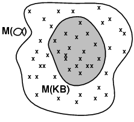

[TOC]

# Chapter 3 

## Searching for solutions 

## Measuring problem-solving performance – completeness, optimality, timecomplexity, space complexity 

## Breadth-firstsearch 

## Uniform-costsearch 

## Depth-firstsearch 

## Depth-limitedsearch 

## Iterativedeepening  

## Heuristicsearch 

## Greedybest-first search 

## A*search 

## Iterative-deepeningA* 

## Heuristicfunctions 

 

# Chapter 4

## Localsearch

Hillclimbing 

Simulatedannealing 

Localbeam search 

Geneticalgorithms 

 

# Chapter 5 

Minimaxsearch 

Alpha-betapruning 

Moveordering 

Evaluationfunctions 

~~Cuttingoff search~~ 

~~Forwardpruning~~ 

Searchvs lookup 

 

# Chapter 6

## Definingcsps 

## Advantagesof csp   

## Constraintgraphs 

## Constraintpropagation 

## Node,arc, path, k-consistency 

## Backtrackingsearch for csps 

## Minimumremaining values heuristic 

## Degreeheuristic 

Least-constrainingvalue heuristic 

~~Forwardchecking~~ 

~~Maintainingarc consistency~~ 

~~Localsearch for csps~~ 

# Chapter 7

## Knowledge-Based agents

**Knowledge-base**: set of **sentences** in a **formal** language

**Knowledge level**: what an agent knows, regardless of how implemented

**Implementation level**: data structures in KB and algorithms that manipulate them

The agent must be able to:

* Represent states, actions, etc.
* Incorporate new percepts
* Update internal representations of the world
* Deduce hidden properties of the world
* Deduce appropriate actions

  

## The Wumpus world

### PEAS description

**Performance measure**:

* gold +1000, death -1000

* -1 per step, -10 for using the arrow

**Environment**:

* Squares adjacent to wumpus are smelly
* Squares adjacent to pit are breezy
* Glitter iff gold is in the same square
* Shooting kills wumpus if you are facing it
* Shooting uses up the only arrow
* Grabbing picks up gold if in same square
* Releasing drops the gold in same square

**Sensors**: Stench, Breeze, Glitter, Bump, Scream

**Actuators**: Left turn, Right turn, Forward, Grab, Release, Shoot

### Wumpus world characterization

**Fully Observable** No – only *local* perception
**Deterministic** Yes – outcomes exactly specified
**Episodic** No – sequential at the level of actions
**Static**  Yes – Wumpus and Pits do not move
**Discrete** Yes
**Single-agent?** Yes – Wumpus is essentially a natural feature

## Entailment

**Entailment** means that one thing *follows from* another:

​					 KB ╞ α 

Knowledge base KB entails sentence α *if and only if* α is true in all worlds where KB is true

*M(α)* is the set of all models of α

Then KB ╞ α iff *M(KB)* $$  \subseteq $$ *M(α)* 

* E.g. KB = Giants won and Reds won,  α = Giants won

## Propositional logic

### Syntax

Propositional logic is the simplest logic

* illustrates basic ideas

The proposition symbols *P~1~*, *P~2~* etc are sentences

* If S is a sentence, $$\neg$$S is a sentence (**negation**)
* If S1 and S2 are sentences, S1 $$\land$$ S2 is a sentence (**conjunction**)
* If S1 and S2 are sentences, S1 $$\lor$$ S2 is a sentence (**disjunction**)
* If S1 and S2 are sentences, S1 $$\Rightarrow$$ S2 is a sentence (**implication**)
* If S1 and S2 are sentences, S1 $$\iff$$ S2 is a sentence (**biconditional**)

### Semantics

Each model specifies true/false for each proposition symbol

Example: 

| P~1,2~ | P~2,2~ | P~3,1~ |
| :----: | :----: | :----: |
| false  |  true  | false  |

Simple recursive process evaluates an arbitrary sentence, e.g.,

* $$\neg$$P~1,2~ $$\land$$ (P~2,2~  $$\lor$$  P~3,1~) = true  $$\land$$  (true  $$\lor$$  false) =  true  $$\land$$  true = true

## Logical equivalence

Two sentences are **logically equivalent** iff true in same models: α ≡ β iff α╞ β and β╞ α

## Validity, and Satisfiability

A sentence is **valid** if it is true in *all* models,

* e.g., True, A $$\lor$$ $$\neg$$A,  A  $$\Rightarrow$$ A, 	(A $$\land$$ (A $$\Rightarrow$$ B)) $$\Rightarrow$$ B

Validity is connected to inference via the **Deduction Theorem**:

* KB ╞ α if and only if (KB $$\Rightarrow$$  α) is valid

A sentence is **satisfiable** if it is true in *some* models,

* e.g., A $$\lor$$ B, C

A sentence is **unsatisfiable** if it is true in *no* models,

* e.g., A $$\land$$ $$\neg$$ A

Satisfiability is connected to inference via the following:

* KB ╞ α if and only if (KB $$\land$$ $$\neg$$α) is unsatisfiable

## Inference rules and proofs

Proof methods divide into (roughly) two kinds:

#### Application of inference rule

* Legitimate (sound) generation of new sentences from old
* **Proof** = a sequence of inference rule applications 

  * Can use inference rules as operators in a standard search algorithm
* Typically require transformation of sentences into a **normal form**

#### Model checking

* Truth table enumeration (always exponential in *n*)
* Improved backtracking, e.g., Davis--Putnam-Logemann-Loveland (DPLL)
* heuristic search in model space (sound but incomplete)
  * e.g., min-conflicts-like hill-climbing algorithms

### Inference rules

**Modus ponens**: (α $$\Rightarrow$$ β, α) $$\Rightarrow$$ β
**And-elimination**: (α $$\land$$ β, α) $$\Rightarrow$$ β
All the logical equivalences can be used as inference rules.   

## Proof by resolution

**Conjunctive Normal Form** (CNF): conjunction of disjunctions of literals, clauses

* E.g., (A $$\lor$$ $$\neg$$B) $$\land$$ (B $$\lor$$ $$\neg$$C $$\lor$$ $$\neg$$D)

Resolution is sound and complete for propositional logic

## Converting to CNF

B~1,1~ $$\Leftrightarrow$$ (P~1,2~ $$\lor$$ P~2,1~)

1. Eliminate $$\Leftrightarrow$$, replacing α $$\Leftrightarrow$$ β with (α $$\Rightarrow$$ β)$$\land$$(β $$\Rightarrow$$ α).
   * (B~1,1~ $$\Rightarrow$$ (P~1,2~ $$\lor$$ P~2,1~)) $$\land$$ ((P~1,2~ $$\lor$$ P~2,1~) $$\Rightarrow$$ B~1,1~)
2. Eliminate $$\Rightarrow$$, replacing α $$\Rightarrow$$ β with $$\neg$$α $$\lor$$ β.
   * ($$\neg$$B~1,1~ $$\lor$$ P~1,2~ $$\lor$$ P~2,1~) $$\land$$ ($$\neg$$(P~1,2~ $$\lor$$ P~2,1~) $$\lor$$ B~1,1~)
3. Move $$\neg$$  inwards using de Morgan's rules and double-negation:.
   - ($$\neg$$B~1,1~ $$\lor$$ P~1,2~ $$\lor$$ P~2,1~) $$\land$$ (($$\neg$$P~1,2~ $$\land$$ $$\neg$$P~2,1~) $$\lor$$ B~1,1~)
4. Apply distributivity law ($$\land$$ over $$\lor$$) and flatten:
   * ($$\neg$$B~1,1~ $$\lor$$ P~1,2~ $$\lor$$ P~2,1~) $$\land$$ ($$\neg$$P~1,2~  $$\lor$$ B~1,1~) $$\land$$  ( B~1,2~ $$\lor$$ $$\neg$$P~2,1~)

Proof by contradiction, i.e., show KB$$\land$$$$\neg$$α unsatisfiable

KB = (B~1,1~ $$\Leftrightarrow$$ (P~1,2~ $$\lor$$ P~2,1~)) $$\land$$ $$\neg$$ B~1,1~ α = $$\neg$$P~1,2~

## Forward,backward chaining

### Hornclause

Horn Form (restricted)

- KB = **conjunction** of **Horn clauses**

- Horn clause = 

  - proposition symbol;  or

  - (conjunction of symbols) $$\Rightarrow$$ symbol
* E.g., C $$\land$$ (B $$\Rightarrow$$ A)  $$\land$$ (C  $$\land$$ D  $$\Rightarrow$$ B)

---

Can be used with **forward chaining** or **backward chaining**.

These algorithms are very natural and run in *linear* time

### Forward chaining

Idea: fire any rule whose premises are satisfied in the KB,

* add its conclusion to the KB, until query is found

* Forward chaining is sound and complete for Horn KB

### Backward chaining

Idea: work backwards from the query q:

* to prove *q* by BC,
  * check if *q* is known already, or
  * prove by BC all premises of some rule concluding *q*

Avoid loops: check if new subgoal is already on the goal stack

Avoid repeated work: check if new subgoal:

1. has already been proved true, or
2. has already failed

### Forward vs. backward chaining

* FC is **data-driven*, automatic, unconscious processing,
  * e.g., object recognition, routine decisions
* May do lots of work that is irrelevant to the goal 
* BC is **goal-driven*, appropriate for problem-solving,
  * e.g., Where are my keys? How do I get into a PhD program?
* Complexity of BC can be *much less* than linear in size of KB

~~Propositionalinference based on model checking – 2 approaches~~

Chapter8 

Firstorder logic vs propositional logic 

Syntaxand semantics of FOL 

Assertionsand queries in FOL 

Knowledgeengineering in FOL 

 

# Chapter 9 

Universalinstantiation 

Existentialinstantiation 

Unification 

Forwardchaining 

Backwardchaining 

ConvertingFOL to CNF 

FOLproof by resolution 

 

# Chapter 25 

Localization 

Mapping 

SLAM 

Configurationspace 

Skeletonization 

~~PIDcontrol~~ 

Potentialfield control 

 

Learning 

Machinelearning 

Typesof learning 

Reinforcementlearning 

Q-learning 

 

DeepLearning 

Deeplearning applications  

Deeplearning architectures 

 

 

 

 

 

  